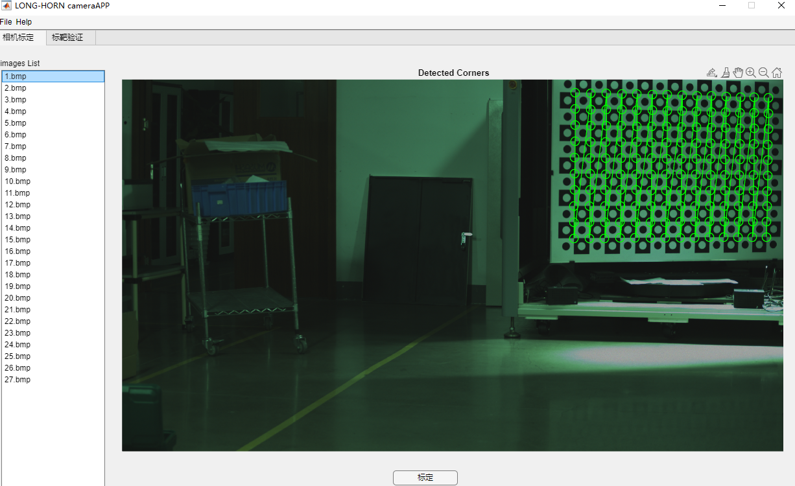
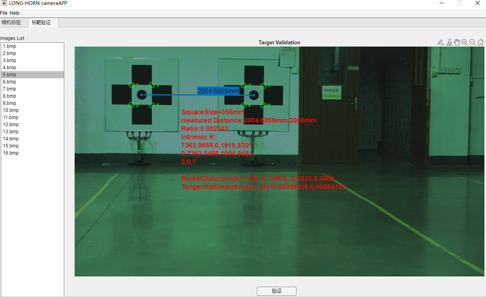

# 标靶测距验证相机内参精度

通过对某个模组相机进行内参"精度"验证，验证方式为：对于已估计好的某个模组相机内参(包括畸变中心和系数)在不同角度拍摄位于同一平面内且标靶中心距为1.7米的两个标靶视角情况下验证其内参是否能够满足合规性。

2023.6.1 结论：对两个标靶中心测距，当棋盘格大小为300mm*300mm时候，视角测量距离均在1.7米左右，可达到毫米级误差，所估的模组相机内参(包括畸变中心和系数)均满足要求！

## data

APP所需要的数据`data/`存放在百度网盘
